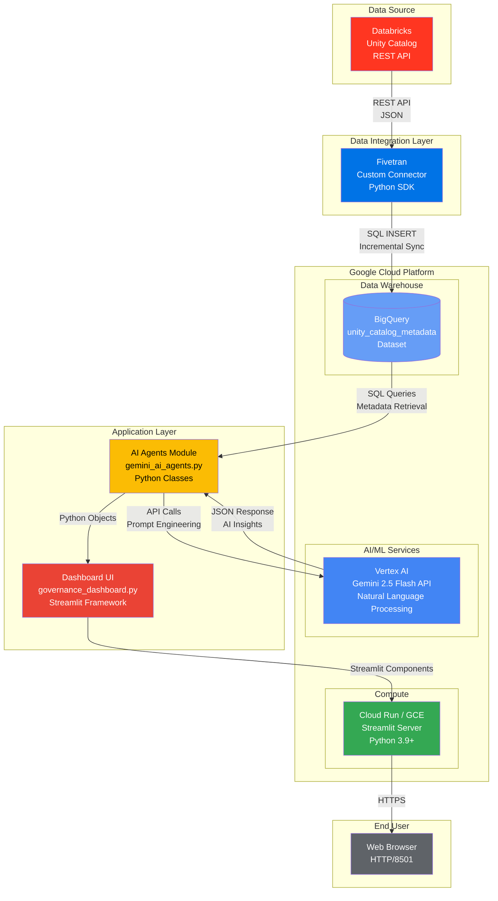

# AI Dashboard Architecture

## Overview

**The Integration Gap**: Databricks Unity Catalog and Google Cloud Platform lack native integration, preventing organizations from leveraging GCP's AI/ML services for data governance.

**Our Solution**: A custom Fivetran connector bridges this gap by syncing Unity Catalog metadata to BigQuery, enabling AI-powered governance through Vertex AI Gemini 2.5 Flash. The platform provides natural language search, automated documentation, compliance monitoring, and data quality assessments - bringing Databricks governance into the Google Cloud AI ecosystem.

## Technical Architecture



## ASCII Diagram (Alternative View)

```
┌─────────────────────────────────────────────────────────────────┐
│                    governance_dashboard.py                       │
│                   (Interactive Web Interface)                    │
│                                                                  │
│  ┌────────────┐  ┌────────────┐  ┌────────────┐  ┌──────────┐ │
│  │  Overview  │  │   Search   │  │    Docs    │  │Compliance│ │
│  │    Page    │  │    Page    │  │    Page    │  │   Page   │ │
│  └─────┬──────┘  └─────┬──────┘  └─────┬──────┘  └────┬─────┘ │
└────────┼───────────────┼───────────────┼──────────────┼────────┘
         │               │               │              │
         │  ┌────────────▼───────────────▼──────────────▼───────┐
         │  │                                                    │
         └──►         gemini_ai_agents.py                       │
            │       (Gemini AI Agents Module)                   │
            │                                                    │
            │  ┌──────────────────────────────────────────────┐ │
            │  │  DataDiscoveryAgent                          │ │
            │  │  • Natural language search                   │ │
            │  │  • Table/schema lookup                       │ │
            │  │  • Metadata queries                          │ │
            │  └──────────────────────────────────────────────┘ │
            │                                                    │
            │  ┌──────────────────────────────────────────────┐ │
            │  │  ComplianceGuardianAgent                     │ │
            │  │  • Compliance scoring                        │ │
            │  │  • Risk assessment                           │ │
            │  │  • Policy monitoring                         │ │
            │  └──────────────────────────────────────────────┘ │
            │                                                    │
            │  ┌──────────────────────────────────────────────┐ │
            │  │  AutoDocumentationAgent                      │ │
            │  │  • AI-generated descriptions                 │ │
            │  │  • Data dictionary creation                  │ │
            │  │  • Column documentation                      │ │
            │  └──────────────────────────────────────────────┘ │
            │                                                    │
            │  ┌──────────────────────────────────────────────┐ │
            │  │  DataQualityMonitorAgent                     │ │
            │  │  • Freshness checks                          │ │
            │  │  • Anomaly detection                         │ │
            │  │  • Quality reports                           │ │
            │  └──────────────────────────────────────────────┘ │
            │                                                    │
            │              Powered by ⚡                         │
            │         Google Gemini 2.5 Flash                   │
            └───────────────────┬────────────────────────────────┘
                                │
                                │ SQL Queries
                                ▼
                    ┌───────────────────────┐
                    │   Google BigQuery     │
                    │  (Metadata Storage)   │
                    │                       │
                    │ • unity_catalog_      │
                    │   metadata dataset    │
                    │ • Tables metadata     │
                    │ • Columns metadata    │
                    └───────────────────────┘
```

## Component Interaction Flow

1. **User** interacts with **Streamlit Dashboard** UI
2. **Dashboard** calls **AI Agents** for intelligent features
3. **AI Agents** query **BigQuery** for metadata
4. **AI Agents** use **Gemini 2.5 Flash** to process and analyze data
5. **Dashboard** displays results to user

## File Descriptions

### `gemini_ai_agents.py` (Located in DataGovbyAIagents/)
**Role**: Backend AI intelligence layer

**Contains**:
- 4 AI agent classes powered by Gemini 2.5 Flash
- BigQuery query logic
- Natural language processing
- Response formatting

**Key Classes**:
- `DataDiscoveryAgent` - Search and discovery
- `ComplianceGuardianAgent` - Governance monitoring
- `AutoDocumentationAgent` - AI documentation generation
- `DataQualityMonitorAgent` - Quality monitoring

### `governance_dashboard.py` (Located in DataGovbyAIagents/)
**Role**: Frontend web interface

**Contains**:
- Streamlit UI components
- Page layouts and navigation
- Data visualizations (Plotly charts)
- User interaction handlers

**Pages**:
- 📊 Overview - Key metrics dashboard
- 🔎 Table Search - Natural language search
- 📝 Documentation - AI-powered doc generation
- ✅ Compliance - Governance monitoring

## Data Flow Example

```
User Query: "Find all customer tables"
         ↓
   Streamlit Dashboard
         ↓
   DataDiscoveryAgent.query()
         ↓
   BigQuery SQL Query
         ↓
   Results Processing
         ↓
   Gemini 2.5 Flash (if needed)
         ↓
   Formatted Response
         ↓
   Display in UI
```
